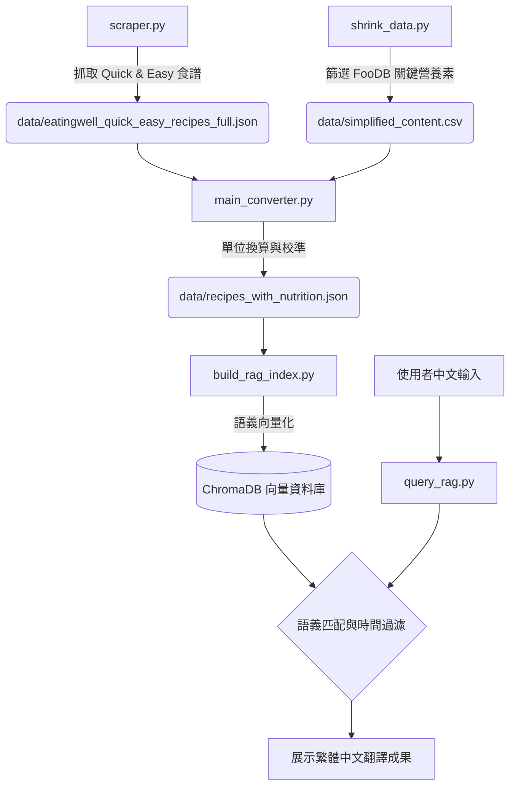

# EatingWell Recipe Intelligence & Nutrition Analyzer (RAG Version)

個整合網路爬蟲、營養科學計算與 AI 語義檢索 (RAG) 的智慧系統。專門針對 EatingWell 網站的 "Quick & Easy" 分類進行數據抓取與分析，並提供精準的營養成分預估與智慧搜尋功能。

## 系統工作流程 (Workflow)



## 檔案功能說明與關係

| 檔案名稱 | 核心功能 | 技術方法 |
| --- | --- | --- |
| **scraper.py** | 數據源頭：遞歸抓取 EatingWell Quick & Easy 分類的食譜。 | BeautifulSoup4 / Requests |
| **shrink_data.py** | 數據預處理：將 700MB+ 的 FooDB 原始數據壓縮至關鍵營養素。 | Pandas Data Cleaning |
| **main_converter.py** | 營養計算：執行食材模糊比對，並校正一人份營養數值。 | FuzzyWuzzy / Nutrition Engine |
| **build_rag_index.py** | 建立索引：將食譜文本轉為向量，並存入 Metadata (時間、熱量)。 | ChromaDB / Sentence-Transformers |
| **query_rag.py** | 智慧介面：支援中文搜尋、時間邏輯過濾與自動結果翻譯。 | RAG / Deep-Translator |

## 如何擴展爬蟲抓取其他類別

目前的 `scraper.py` 預設以 EatingWell 的 `Quick & Easy Recipes` 作為起點。若你想擴展抓取範圍以獲取更多元的食材與食譜數據，請參考以下步驟：

### 1. 尋找目標分類 URL
前往 [EatingWell 官網](https://www.eatingwell.com/recipes-5271128)，尋找你感興趣的分類頁面。
* 例如：**Healthy Dinners** (`/category/4262/healthy-dinner-recipes/`)
* 例如：**Diabetic Diet** (`/category/4268/diabetic-diet-recipes/`)

### 2. 修改起始點變數
開啟 `scraper.py`，定位至檔案末部的 `main` 區塊或 `base_url` 變數：
```python
# 將原有的連結替換為目標分類的連結
base_url = "[https://www.eatingwell.com/category/xxxx/your-target-category/](https://www.eatingwell.com/category/xxxx/your-target-category/)"

## 安裝與執行步驟

### 1. 軟體環境

* Python 版本：**3.12.7** (強烈建議，以確保 ChromaDB 穩定性)
* 建議建立虛擬環境：`python -m venv venv`

### 2. 安裝套件

```powershell
pip install pandas thefuzz requests beautifulsoup4 chromadb sentence-transformers pydantic-settings deep-translator tqdm

```

### 3. 執行順序

1. 執行 `python scraper.py` 獲取原始數據。
2. 確保 `foodb_2020_04_07_csv/` 資料夾存在，執行 `python shrink_data.py`。
3. 執行 `python main_converter.py` 完成營養素換算。
4. 執行 `python build_rag_index.py` 建立 AI 向量索引。
5. 執行 `python query_rag.py` 進行查詢。

## 可能遇見的問題與解決方法

* **PydanticImportError (BaseSettings)**
* 原因：Python 版本過新 (3.14) 或版本不相容。
* 解決：請確保在 Python 3.12 環境下執行，並安裝 `pydantic-settings`。


* **ONNX Runtime 缺失**
* 原因：某些環境下 ChromaDB 依賴的向量運算庫無法安裝。
* 解決：請檢查是否已安裝 Visual Studio C++ Build Tools，或切換至 Python 3.12。


* **搜尋結果不符合時間限制**
* 原因：`build_rag_index.py` 未正確提取 `Total_Time_Raw`。
* 解決：重新跑一遍索引建立腳本，確認 `total_time` 標籤已正確寫入。


## 預期成果

* 系統可理解「10分鐘內快速早餐」並精確排除 15 分鐘以上的食譜。
* 支援模糊意圖，例如輸入「腸胃不適」可媒合到清淡、簡單的食材組合。
* 輸出結果包含完整翻譯的標題、描述、一人份營養素、食材清單與作法。

## 擴充營養素操作說明

若需增加目前四大類以外的營養素（如：維生素 C、膳食纖維）：

1. **修改 shrink_data.py**：在 `keep_nutrients` 變數中加入該營養素在 FooDB 中的完整名稱。
2. **修改 main_converter.py**：在 `TARGET_MAP` 中加入該營養素的 ID 與名稱映射，並在加總邏輯中新增對應欄位。
3. **修改 query_rag.py**：在結果輸出部分，將新增的營養素數值格式化顯示。
4. **重新建檔**：依序重新執行 `main_converter.py` 與 `build_rag_index.py` 即可。

---